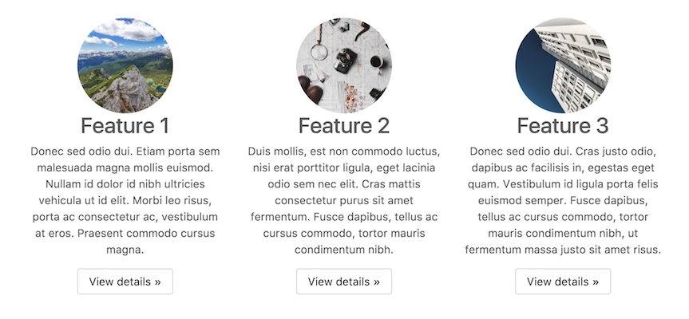

# Introduction

## 

### Getting started

- Open the [project](https://thimble.mozilla.org/en/projects/291425/remix) and select the `index.html` file in the editor to get started
- The code of the page is displayed on the left side of the editor on the right side you can see the result.
- If you move the cursor around inside of the code the sections of the page which it defines are highlighted

- Click on the Element selector to do the reverse. If you hover over parts of the page the coresponding code sections get hightlighted 

#### Excercies

- [ ] Change the title of page in the black header bar

  

- [ ] Add a third link

  

- [ ] Change the images, so each feature has a different image (`images/map.jpg`, `images/mountain.png`, `images/skyscraper`)

  

  There are three images in the files sidebar 

  

  > Bonus: upload your own picture
   
- [ ] 
